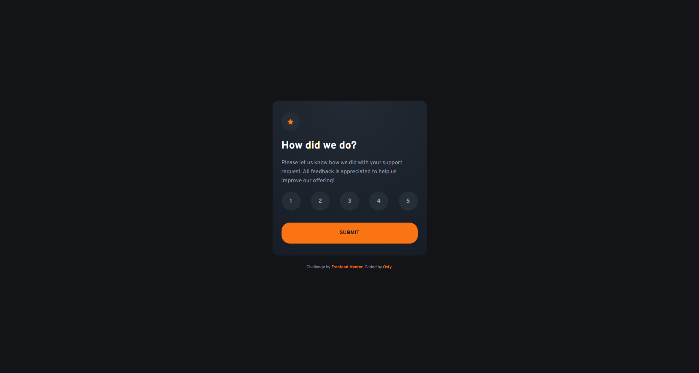

# Frontend Mentor - Interactive rating component solution

This is a solution to the [Interactive rating component challenge on Frontend Mentor](https://www.frontendmentor.io/challenges/interactive-rating-component-koxpeBUmI). Frontend Mentor challenges help you improve your coding skills by building realistic projects.

## Table of contents
- [Overview](#overview)
  - [The challenge](#the-challenge)
  - [Screenshots](#screenshots)
  - [Links](#links)
- [My process](#my-process)
  - [Built with](#built-with)
  - [What I learned & Key Challenges](#what-i-learned--key-challenges)
  - [Project Estimation & Retrospective](#project-estimation--retrospective)
- [Author](#author)

## Overview

### The challenge
Users should be able to:
- View the optimal layout depending on their device's screen size (Desktop, Tablet, and Mobile).
- See interactive hover and keyboard focus states for all form controls and interactive targets.
- Select and lock a number rating from 1 to 5, dynamically mutating the Submit state.
- Experience a clean view-switching transition revealing the "Thank you" card state upon secure form submission.

### Screenshots
  
*Fig 1. Final look of my responsive Stats preview card component using production-ready SCSS compilation and hardware-accelerated image blend modes.*

### Links
- Solution URL: [Solution Link](https://github.com/Osty-trainee/Interactive-rating-component)
- Live Site URL: [Live Site Link](https://osty-trainee.github.io/Interactive-rating-component/)

## My process

### Built with
- Semantic HTML5 markup (`<form>` architecture encapsulating native input nodes, `<label>` accessibility wrappers, and independent viewport cards).
- CSS Custom Properties (`:root`) acting as a single source of truth for design tokens, component spacing metrics, and color palettes.
- Modular Sass/SCSS architecture dividing code blocks into dedicated system layers (`_fonts`, `_variables`, `_reset`, `main.scss`) using compiled imports.
- Pure Flexbox alignment modules ensuring perfect multi-axis centering for both global viewports and internal component vectors.
- Vanilla JavaScript (Event tracking via event listeners, DOM class manipulation, and native `FormData` state capturing).
- Safe Git repository state tracking, locking raw assets while excluding local environment artifacts via an optimized `.gitignore` file.

### What I learned & Key Challenges

This project featured strict UI layouts and interactive states that exposed a few interesting rendering bugs and alignment challenges:

1. **The Letter-Spacing Text Centering Offset:**
   During the design system setup, the rating numbers inside the circular `<span>` elements were visually shifting to the left instead of maintaining a clean geometric center. This was caused by an inherited `letter-spacing: 1.87px;` rule. In CSS, letter-spacing appends an invisible padding-right container boundary to every single character node. To fix this, I stripped the spacing rule from the individual rating spans, allowing flex centering mechanics to map the nodes properly:
   ```scss
   span {
       display: flex;
       justify-content: center;
       align-items: center;
       width: 2.625rem;
       height: 2.625rem;
       border-radius: 50%;
       /* Removed letter-spacing to prevent the right-side layout nudge */
   }
   ```

2. **The Line-Height Vertical Tracking Collapse:**
   Even after removing the horizontal letter offset, the numbers inside the circles remained slightly pulled toward the top edge. When working with single-character nodes inside an explicit `display: flex` container, native `line-height` standard scaling rules calculation adds artificial structural gaps beneath the text baseline. Overriding the height constraint to a clean integer value restored pristine vertical symmetry:
   ```scss
   span {
       font-size: 0.875rem;
       line-height: 1; /* Completely resets the line bounding box for exact flex distribution */
   }
   ```

3. **Dynamic State Binding via Form Controls:**
   To guarantee clean semantic markup, I used native `<input type="radio">` tags hidden behind a zero-opacity wrapper. The primary technical hurdle was syncing the user's current selection with the submit button layout before sending data. Instead of loops, I utilized the JavaScript `change` event coupled with `FormData` verification to append a styling modifier to the UI target safely:
   ```javascript
   ratingForm.addEventListener('change', () => {
     const formData = new FormData(ratingForm);
     if (formData.has('rating')) {
       submitBtn.classList.add('active'); // Toggles the production SCSS color state instantly
     }
   });
   ```

## Project Estimation & Retrospective
- **Initial Estimation:** 2 to 3 hours.
- **Actual Time Taken:** ~ 4 hours (including local font asset configuration, keyboard focus outline testing, and multi-state logic debugging).

**Retrospective Summary:**  
Using semantic radio buttons instead of unmapped `<div>` tags makes form styling more complex but guarantees top-tier accessibility. Overriding default native form fields using structural `<span>` targets combined with relative selectors like `input:checked + span` creates robust component UI states. This ensures that focus-visible keyboard navigation (`Tab` key tracking) works flawlessly across all mobile, tablet, and desktop viewports.

## Author

- GitHub - [@Osty-trainee](https://github.com/Osty-trainee)
- Frontend Mentor - [@Osty-trainee](https://www.frontendmentor.io/profile/Osty-trainee)
